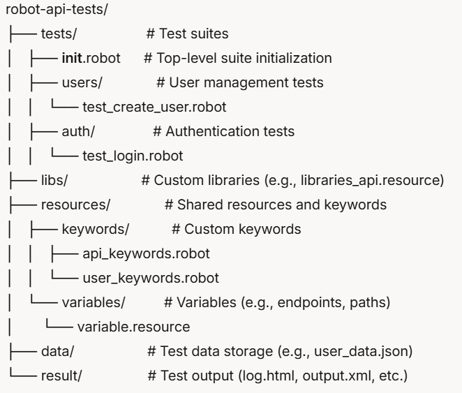

# robot-api-tests
## 🚀 API Test Automation with Robot Framework

This repository contains automated API tests for the [ServeRest API](https://serverest.dev/) using Robot Framework. The tests cover user management (creation and retrieval) and authentication operations, ensuring robust validation of both successful and error scenarios.

### 📌 Technologies Used
- **Framework**: [Robot Framework](https://robotframework.org/)
- **Library**: [RequestsLibrary](https://marketsquare.github.io/robotframework-requests/)
- **Language**: Python 3.x
- **API**: [ServeRest API](https://serverest.dev/)
- **Faker**: [FakerLibrary](https://github.com/peritus/robotframework-faker) for generating test data

---

## 📂 Project Structure




- **`tests/`**: Contains test suites organized by functionality (`users` for creation/retrieval, `auth` for login).
- **`data/user_data.json`**: Stores user data generated during tests (e.g., for login after creation).
- **`result/`**: Stores execution outputs (created automatically).

---

## ✨ Features
- **User Management**:
  - Create users with valid data.
  - Handle errors (e.g., missing email, invalid IDs).
  - Retrieve user details by ID.
- **Authentication**:
  - Login with valid credentials.
  - Test invalid login attempts (e.g., wrong password).
- **Dynamic Data**: Uses FakerLibrary to generate realistic test data.
- **Error Handling**: Validates API error responses (e.g., `400`, `401`).

---

## ⚙️ Prerequisites
- **Python 3.12.9: Installed on your system.
- **Robot Framework**: Install via pip:
  ```bash
  pip install robotframework
- **RequestsLibrary: For API calls:** 
  ```bash
  pip install robotframework-requests
- **FakerLibrary: For fake data generation:** 
  ```bash
  pip install robotframework-faker